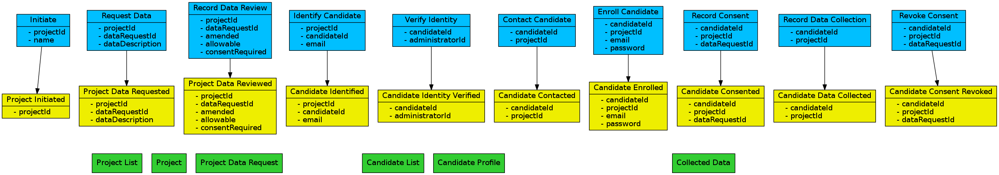

# Consentaur





```
# Consentaur

Initiate-> // projectId, name
Project Initiated // projectId
Request Data-> // projectId, dataRequestId, dataDescription
Project Data Requested // projectId, dataRequestId, dataDescription
Project List*
Project*

Record Data Review-> //  projectId, dataRequestId, amended, allowable, consentRequired
Project Data Reviewed // projectId, dataRequestId, amended, allowable, consentRequired
Project Data Request*

Identify Candidate -> // projectId, candidateId, email
Candidate Identified // projectId, candidateId, email
Candidate List*
Candidate Profile*

Contact Candidate -> // candidateId, projectId
Candidate Contacted // candidateId, projectId
Enroll Candidate-> // candidateId, projectId, email, password
Candidate Enrolled // candidateId, projectId, email, password

Record Consent-> // candidateId, projectId, dataRequestId
Candidate Consented // candidateId, projectId, dataRequestId

Record Data Collection-> // candidateId, projectId
Candidate Data Collected // candidateId, projectId
Collected Data*

Revoke Consent-> //  candidateId, projectId, dataRequestId
Candidate Consent Revoked // candidateId, projectId, dataRequestId
```


## Getting Started

link to discussion: https://t.me/joinchat/DIfB9wqLLzn8mvB7irBdqA
